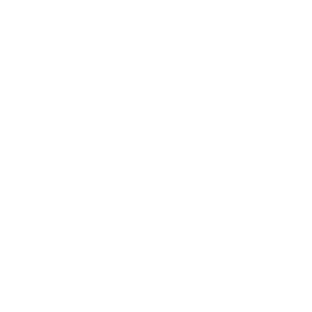

<h1 align="center">
  
</h1>

<p align="center">
    <em>Building AI agents that think, act, and deliver — from prototype to production.</em>
</p>

<p align="center">
    <a href="https://www.linkedin.com/in/anas-ur-rehman-/"></a>
    <a href="mailto:iamkhan7969@gmail.com"></a>
</p>

<details open>
  <summary><b>About Me</b></summary>
  <br/>

```python
class AnasUrRehman:
    """Turning AI hype into AI products — agents that work, apps that scale."""

    def __init__(self):
        self.role = "Agentic AI Expert & Fullstack Developer"
        self.focus = "AI Agents, Fullstack Systems & Business Automation"
        self.build = {
            "ai_agents":    ["Claude Code Skills", "Groq", "Dialogflow", "OpenAI"],
            "fullstack":    ["React", "Next.js", "Node.js", "Express.js", "Tailwind"],
            "backend":      ["Python", "FastAPI", "Streamlit"],
            "databases":    ["MongoDB", "PostgreSQL", "Supabase", "MySQL"],
            "infra":        ["Docker", "Vercel", "GitHub Actions"],
        }
        self.domains = ["Agentic AI", "Business Automation", "Fullstack Web Dev"]
        self.now = "Building agents that act, not just answer"
        self.vibe = "Ship fast. Let code speak."

    def mission(self):
        return "Solve real problems with AI. Nothing else."
```

</details>

---

<p align="center">
    🛠️ AI Agents · Fullstack Apps · Business Automation · Shipping Ideas into Production
</p>

<p align="center">
    <code>Python</code> · <code>TypeScript</code> · <code>JavaScript</code>
    <br/>
    <code>OpenAI</code> · <code>Claude Code</code> · <code>Groq</code> · <code>MCP</code> · <code>Dialogflow</code>
    <br/>
    <code>FastAPI</code> · <code>Next.js</code> · <code>React</code> · <code>Node.js</code> · <code>Express.js</code> · <code>Docker</code>
</p>

<p align="center">
    
    &nbsp;
    
    &nbsp;
    
    &nbsp;
    
    &nbsp;
    
    &nbsp;
    
    &nbsp;
    
</p>

---

<blockquote align="center">
  <em>
    "Stay patient and trust your journey.<br/>
    Every line of code you write today<br/>
    is building the future you imagined yesterday."
  </em>
</blockquote>

<p align="center">
  <strong>
    Every step toward your goal is a step closer to a future of your own making.
  </strong>
</p>

<p align="center">
  
</p>
